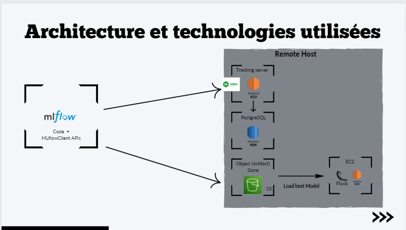
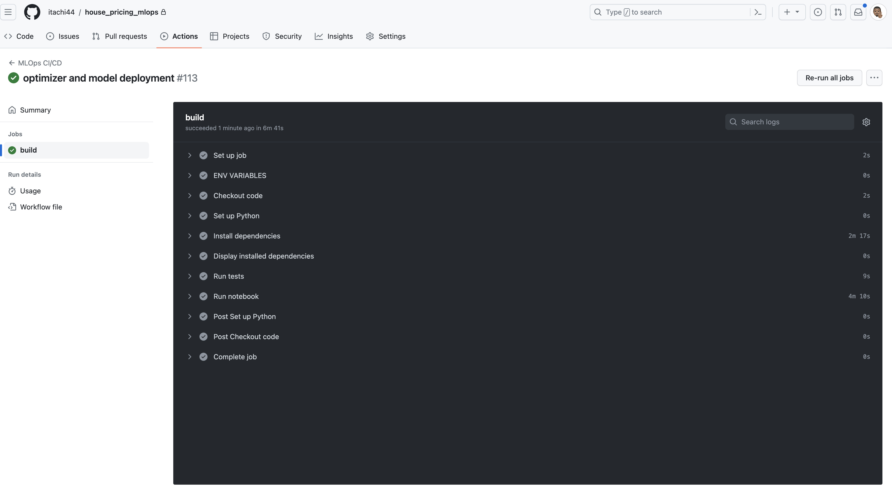
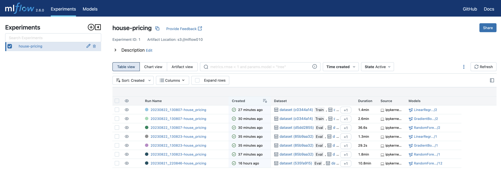
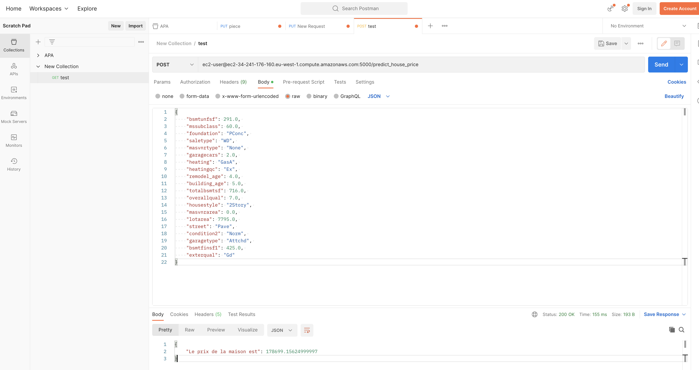

# house_pricing_mlops

### Description

Ce projet à pour but d'implémenter un algorithme de prédiction des prix des maisons.
Les données utilisées proviennent du dataset ```house_prices```, avec 79 variables explicatives décrivant (presque) tous les aspects des maisons résidentielles à Ames (Iowa, US).

L'éxécution du projet consistera à réaliser successivement et de manière automatisée les taches suivantes : 

- chargement du dataset
- analyse explorative des données
- prétraitement des données
- sauvegarde des données prétraitées
- entrainement de modèles grace à des pipelines prédéfinis
- évaluation des métriques
- optimisation et choix du meilleur modèle
- déploiement du modèle dans un bucket S3
- utilisation du modèle depuis une API Flask


### Architecture



### Prérequis

#### 1. clonage du projet

#### 2. créer un environnement virtuel : python -m venv ```<venv_name>``` puis ```source venv_name/bin/activate``` (pour macos et linux)

#### 3. installation des dépendances : pip install -r requirements.txt

### Exécution en local : 

#### step 1 : rendre exécutable le fichier ```run_notebook.sh``` avec la commande chmod +x run_notebook.sh

#### step 2 : exporter les variables d'environnement suivants :

- export MLFLOW_SERVER_USERNAME=<your_mlflow_server_username>
- export MLFLOW_SERVER_PASSWORD=<your_mlflow_server_pwd>
- export AWS_ACCESS_KEY_ID=<your_bucket_access_key_id>
- export AWS_SECRET_ACCESS_KEY=<your_bucket_secret_access_key>

#### step 3 : exécuter le fichier ```run_notebook.sh``` avec la commande ```./run_notebook.sh```

### Exécution sur github Action :

Dans github le workflow est éxécuté à chaque mis à jour sur la branche main, pour réexécuter le workflow automatisé, il suffit de : 

- mêttre à jour la branche
- ou d'aller dans l'onglet Actions pour choisir un job puis le réexécuter



### MLFLOW Tracking :
#### Le UI de mlflow se trouve à l'adresse ```http://ec2-3-253-117-137.eu-west-1.compute.amazonaws.com:5000/``



### Business performances : 
#### L'API pour utiliser le modèle se trouve à l'adresse ```http://ec2-3-253-117-137.eu-west-1.compute.amazonaws.com:8000```, voici un example de requête CURL : 

((()))
